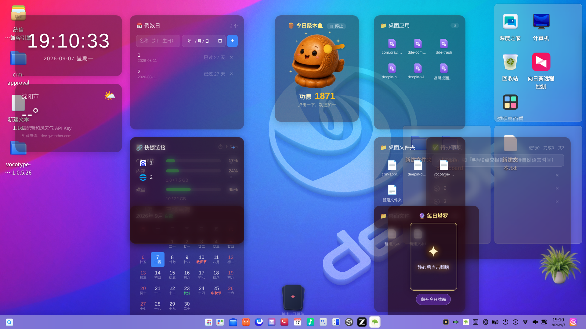

# 唤启 HuanQi Launcher Deck

> 所有应用，一屏全览，一唤即启。基于 DTK6 的 deepin 原生应用启动器。



## 功能介绍

**唤启**是一个托盘常驻的桌面应用启动器，专为 deepin 25 设计。按下 `Ctrl+J`，所有已安装的应用以卡片形式一屏铺开——悬停翻面看详情、花色分类、常用自动浮前、点击启动。

### 应用一屏模式

- 自动扫描 `/usr/share/applications` 等目录下的全部 .desktop 条目（含本地覆盖与 zh_CN 本地化）
- 卡片网格自适应缩放：无论 34 款还是 100+ 款，全部完整可见于同一屏
- 花色分类：♦社交通讯 / ♣影音游戏 / ♥浏览器 / ♠开发工具 / ★效率工具 / ⚙系统组件 / ✦未名之牌，支持自建分类
- 悬停翻面查看应用详情与描述
- 常用自动浮前 + 手动置顶
- 全键盘导航：方向键选牌 · Enter 启动

### 空当接龙游戏模式

- 微软原版发牌算法（1-32000 局，局局可通关）
- 标准规则：红黑交替降序、序列移动、自由位/回收位
- 进度自动保存，重启不丢局
- 发牌动画：三段抖洗 + 逐张飞出 + 落地翻面
- 难度选择：初级（快速局）/ 中级（练习局）/ 经典（随机局）

### 其他特性

- 托盘常驻 + `Ctrl+J` 全局热键唤起
- 四套配色预设 + 透明度滑条 + 接龙牌背主题
- 老虎机小游戏（金币系统 / 头奖庆祝 / 每小时限玩）
- 系统级真毛玻璃（DBlurEffectWidget BehindWindowBlend）
- 单实例 / 渲染错误上报 / 日志自动轮转

## 安装方式

### 从源码构建（deepin 25）

```bash
sudo apt install cmake pkg-config qt6-base-dev qt6-base-dev-tools \
  libdtk6core-dev libdtk6gui-dev libdtk6widget-dev libx11-dev libxcb1-dev
git clone https://github.com/dgr1771/deepin-launcherdeck.git
cd deepin-launcherdeck
cmake -B build -DCMAKE_BUILD_TYPE=Release
cmake --build build -j$(nproc)
sudo cp build/deepin-launcherdeck /usr/bin/
```

### deb 包安装

从 [Releases](https://github.com/dgr1771/deepin-launcherdeck/releases) 下载 .deb 后：

```bash
sudo dpkg -i deepin-launcherdeck_*.deb
sudo apt-get install -f
```

## 使用说明

| 操作 | 效果 |
|------|------|
| `Ctrl+J` | 唤起 / 收起应用一屏 |
| 悬停卡片 | 翻面查看详情 |
| 单击卡片 | 启动应用 |
| 右键卡片 | 归类 / 置顶 / 立即启动 |
| 方向键 + 回车 | 键盘选牌启动 |
| `🎮` 按钮 | 切换空当接龙游戏模式 |
| `⚙` 按钮 | 外观设置（配色/透明度/牌背） |
| 托盘右键 | 展开一屏 / 重新扫描 / 开机自启 / 退出 |

## 开发过程说明

本项目全程采用 AI 结对开发模式。AI 编程工具为 ZCode（GLM-4）与 Codex，开发过程如下：

### deepin Skills 的使用

开发过程中使用了 [linuxdeepin/deepin-skills](https://github.com/linuxdeepin/deepin-skills) 仓库中的 **dtk-development** Skill：

- **DBlurEffectWidget 集成**：通过 Skill 中 `references/widgets/blur-effect.md` 的指引，将面板背景从自绘半透明底改为 `DBlurEffectWidget` + `BehindWindowBlend` + `AutoColor` 遮罩，实现系统级真毛玻璃效果（Deepin 25 桌面壁纸透过面板呈现模糊质感）
- **DTK6 构建约束**：遵循 Skill 中"先确定 Qt/DTK 主版本再选包名"的约束，全程使用 DTK6/Qt 6 链路（`find_package(Dtk6 REQUIRED COMPONENTS Core Gui Widget)`），未混用 DTK5
- **gotchas 排查**：面板失焦收起与弹窗焦点冲突问题，通过 Skill `references/gotchas.md` 的"QEvent::WindowDeactivate 与模态弹窗共存"章节定位并修复

### AI 辅助开发要点

- **双 AI 并行**：ZCode（GLM-4）负责核心功能开发；Codex 在另一台机器上独立迭代，通过 git 补丁方式合流（`git diff base branch > patch && git apply`）
- **逐帧动画复刻**：AI 逐帧分析 Windows 原版的洗牌/发牌动画时序参数，精确复刻为 Qt QVariantAnimation + QTimer 33ms 时间轴
- **像素级验收**：所有 UI 改动通过 CDP 截屏 + PowerShell 像素采样验证（彩色像素计数/坐标偏移），不依赖肉眼
- **远程联测**：`deploy_deck.py` 一键完成 sync→build→launch→shot→kill 全链路，无需手动 SSH

### 踩坑记录

| 坑 | 根因 | 修法 |
|----|------|------|
| QDesktopServices 开 vim | deepin 上 QDesktopServices 对 .desktop 文件当文本打开 | 改用 gio launch |
| /proc readLine 读不到 | Qt6.8 + Deepin 25 下 QFile atEnd() 对 /proc 恒真 | 改 readAll() 解析 |
| 打包 EBUSY | 工作区文件监视器锁新写文件 | 输出目录移到工作区外 |
| QLatin1Char 截断 | 0x2663 & 0xFF = 'c' | 用 QChar(0x2663) |

## 开源协议

本项目采用 **GPL-3.0** 协议开源。任何人可以自由使用、修改和分发，衍生作品须同样以 GPL-3.0 开源并署名原作者。

## 开发人员

**隔壁村布布**（GitHub: [dgr1771](https://github.com/dgr1771)）
